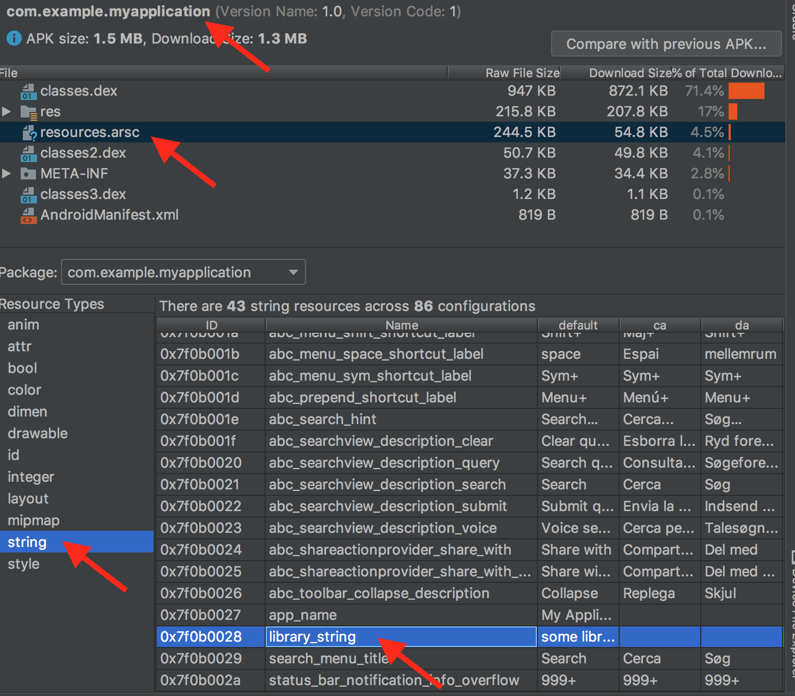
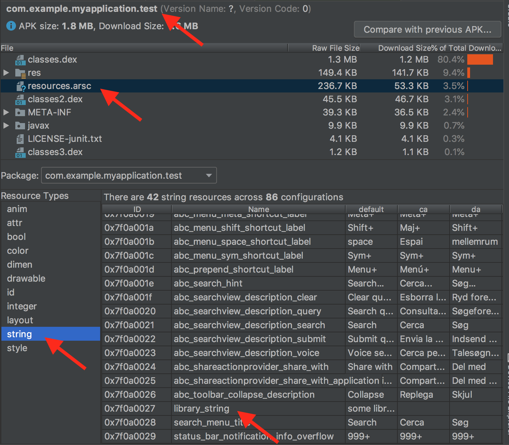

## TL;DR

Instrumentation tests in [test-only module](https://developer.android.com/studio/test#use_separate_test_modules_for_instrumented_tests) fail to compile. But same test in `app` module run fine.

1. run `$ ./gradlew app:connectedDebugAndroidTest` and see tests pass
2. run `$ ./gradlew app_tests:connectedDebugAndroidTest` and see build crash


## The details

*(I've already done most of this for you in this repo)*
 
### Initial project setup

1. Create a new android studio project with `app` android application module
2. Add an `Application` class to module: [here](https://github.com/tir38/android-test-only-module-failure/blob/master/app/src/main/java/com/example/myapplication/MyApplication.java)
3. Add an android library (`mylibrary`) module
4. In `mylibrary` module add a string resource: [here](https://github.com/tir38/android-test-only-module-failure/blob/master/mylibrary/src/main/res/values/strings.xml#L2)
5. In `mylibrary` module add a class that loads string resource: [here](https://github.com/tir38/android-test-only-module-failure/blob/master/mylibrary/src/main/java/com/example/mylibrary/LibraryClass.java)
6. In Application class make sure library loads string resource: [here](https://github.com/tir38/android-test-only-module-failure/blob/master/app/src/main/java/com/example/myapplication/MyApplication.java#L12)
7. Update `app/build.gradle` to depend on `mylibrary`: [here](https://github.com/tir38/android-test-only-module-failure/blob/master/app/build.gradle#L23)
8. You can now run your app `./gradlew app:installDebug`
9. You can also run the auto-created instrumentation test in `app` module and see test pass `./gradlew app:connectedDebugAndroidTest`

*Congratulations, you have a running/working app with a library dependency and passing tests!!!*

### Now things get fun. We are going to create a test-only module:
10. Back in Android Studio's project structure dialog, create a new "android library" module. Call it `app_tests`
11. Change the plugin type in `app_tests/build.gradle` and link to `app` module by adding these lines in the correct block. **The key is that because of some specific test we want to add, this module needs to depend directly on `app` and `mylibrary`** [here](https://github.com/tir38/android-test-only-module-failure/blob/master/app_tests/build.gradle)

```
apply plugin: 'com.android.library' // REMOVE THIS
apply plugin: 'com.android.test' // ADD THIS

android {
    defaultConfig {
        // add this so we can reference app:
        testApplicationId 'com.example.myapplication.test' // ADD THIS
        ...
    }

    // Set the target app project. The module specified here should contain the production code test should run against.
    targetProjectPath ':app' // ADD THIS

}

dependencies {
   implementation project(':app') // ADD THIS
   implementation project(':mylibrary') // ADD THIS
   
	implementation 'androidx.appcompat:appcompat:1.0.2'
	// SEE HERE: these test dependencies are now added via implementation, not androidTestImplementation
	implementation 'androidx.test.ext:junit:1.1.1'
   implementation 'androidx.test:runner:1.2.0'
   implementation 'androidx.test.espresso:espresso-core:3.2.0'
}
```
12. Move the generated instrumentation test in the `app_tests/src/androidTest` into the main directory `app_tests/src/main`: [here](https://github.com/tir38/android-test-only-module-failure/blob/master/app_tests/src/main/java/com/example/app_tests/ExampleInstrumentedTest.java)

13. Now you are ready to run the instrumentation test in your new test-only `app_tests` module:
`$ ./gradlew clean app_tests:connectedDebugAndroidTest`

14. This test will fail with "tests not found" which is the classic indication that something in the app crashed before the test even started. So go looking at device logs we see:

```
android.content.res.Resources$NotFoundException: Unable to find resource ID #0x7f0a0027
    at android.content.res.ResourcesImpl.getResourceEntryName(ResourcesImpl.java:252)
    at android.content.res.Resources.getResourceEntryName(Resources.java:1948)
    at com.example.mylibrary.LibraryClass.printString(LibraryClass.java:13)
    at com.example.myapplication.MyApplication.onCreate(MyApplication.java:12)
    at android.app.Instrumentation.callApplicationOnCreate(Instrumentation.java:1024)
    at androidx.test.runner.MonitoringInstrumentation.callApplicationOnCreate(MonitoringInstrumentation.java:419)
    at android.app.ActivityThread.handleBindApplication(ActivityThread.java:5405)
    at android.app.ActivityThread.-wrap2(ActivityThread.java)
    at android.app.ActivityThread$H.handleMessage(ActivityThread.java:1546)
    at android.os.Handler.dispatchMessage(Handler.java:102)
    at android.os.Looper.loop(Looper.java:154)
    at android.app.ActivityThread.main(ActivityThread.java:6121)
    at java.lang.reflect.Method.invoke(Native Method)
    at com.android.internal.os.ZygoteInit$MethodAndArgsCaller.run(ZygoteInit.java:890)
    at com.android.internal.os.ZygoteInit.main(ZygoteInit.java:780)
```

15. Why did the test fail, you might ask. It's the same test code. It's the same app-under-test. What went wrong? Why did app not find string resource?

16. Let's go digging..

17. Using Android Studio's apk analyzer, inspect the `app` apk (`app/build/outputs/apk/debug/app-debug.apk`). Specifically the `resources.arsc` file. Select `strings` and scroll down to our `library_string`. You can see that the resource has ID `7f0b0028`. This isn't the right string resource. Our crash said that `library_string` was id was `7f0a0027`.



18. Let's just peak in the `app_tests` apk (`app_tests/build/outputs/apk/debug/app_tests-debug.apk`)



Hey!!! `7f0a0027`


Why is the application looking for strings with that resource ID? The app under test is self-contained in the app-debug.apk. I have no clue why this is happening.
